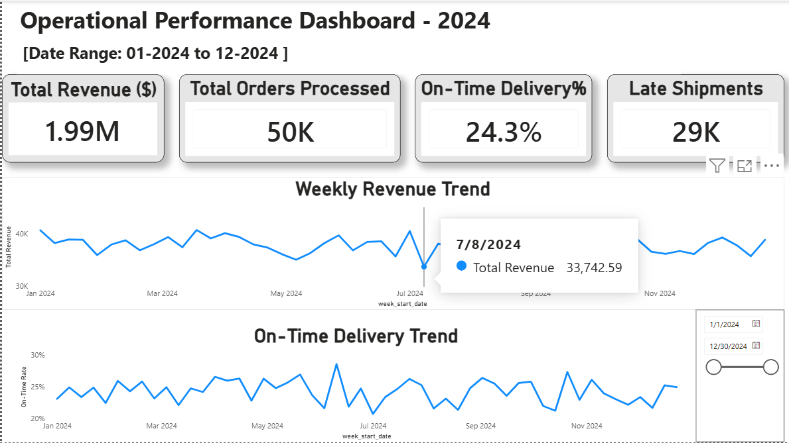
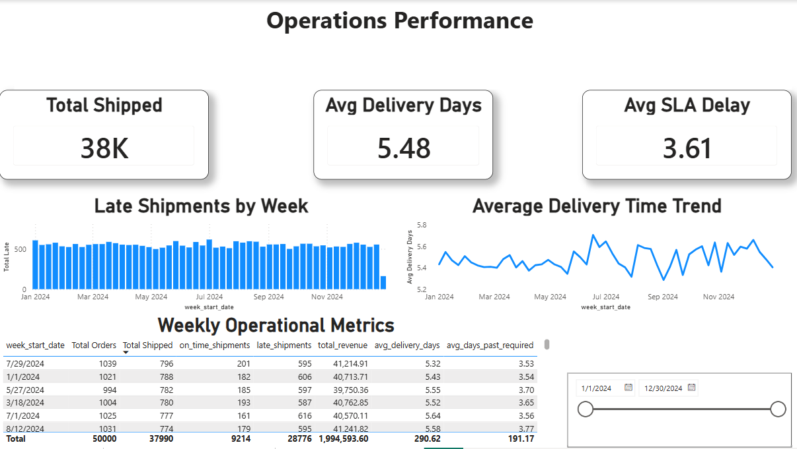
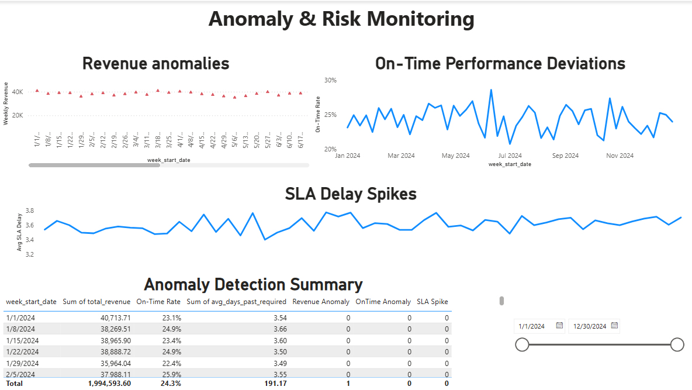

<p align="center">
  <h1>Automated Business Reporting Pipeline & Dashboard</h1>
</p>

<p align="center">
  
  
  
  
</p>

## 📌 Project Overview

This project demonstrates the design and implementation of an **end-to-end automated analytics pipeline** for a simulated operations and fulfillment environment.

It processes **50,000+ synthetic order and shipment records**, applies structured SQL transformations, computes standardized KPIs, detects anomalies, and generates reporting datasets to support operational and management decision-making.

The project highlights how data analysts and analytics engineers can build **reliable, modular, and validation-driven reporting systems** using **Python, SQL, Pandas, and BI-ready data models**.

---
## 📌 Business Problem

Operations and fulfillment teams often rely on fragmented and manual reporting processes across multiple systems, leading to inconsistent KPIs, delayed insights, and limited visibility into order performance, inventory movement, and delivery efficiency.

These challenges increase operational risk, reduce stakeholder confidence in reports, and slow down decision-making. This project addresses these issues by automating data integration, validation, and reporting to deliver consistent, reliable, and timely business insights.

---
## 📌 Solution Architecture

The analytics pipeline follows a modular ETL architecture designed for scalability, reliability, and ease of maintenance.

```
Source Systems
↓
SQL Extraction
↓
Data Transformation
↓
KPI Modeling
↓
Validation Checks
↓
Reporting Layer
↓
Power BI Dashboards
```
Each stage is implemented as an independent component, enabling efficient troubleshooting, performance optimization, and future integration with cloud-based or real-time data platforms.

---
## 📌 Data Sources

The pipeline integrates multiple structured datasets designed to simulate enterprise operational systems and reporting environments.

Primary data sources include:

- Sales and order transaction records  
- Inventory and warehouse management data  
- Shipment and delivery tracking logs  
- Customer and product reference tables  

Synthetic datasets were generated to reflect real-world data distributions, volume patterns, and quality variations commonly observed in large-scale business systems.

---
## 📌 ETL & Data Processing

The pipeline implements a structured ETL workflow to ensure consistent data ingestion, transformation, and quality control.

Key processing steps include:

- Extracting raw datasets using optimized SQL queries  
- Cleaning, normalizing, and enriching transactional and operational data  
- Applying business rules for metric standardization  
- Aggregating records for KPI computation and trend analysis  
- Implementing validation checks to detect missing, duplicate, and inconsistent values  
- Logging processing results for monitoring and troubleshooting  

All transformations are organized into modular SQL scripts and automated execution workflows.

---
## 📌 Key Performance Indicators (KPIs)

The pipeline generates standardized and validated performance metrics to support operational monitoring and management reporting.

Key KPIs include:

- Order fulfillment rate  
- Inventory turnover ratio  
- Revenue and sales trends  
- On-time delivery percentage  
- Backorder and delay frequency  
- Customer service performance indicators  

These metrics are calculated using consistent business logic to ensure accuracy, comparability, and alignment with stakeholder reporting requirements.

---
## 📌 Dashboard & Visualization

The processed datasets are structured for direct integration with business intelligence tools, including Power BI, to support interactive and executive-level reporting.

The dashboards provide:

- Real-time monitoring of operational performance  
- Trend and variance analysis across key metrics  
- Exception and anomaly reporting  
- Drill-down views for detailed investigation  
- Summary views for leadership and management  

Dashboard outputs enable stakeholders to quickly identify risks, opportunities, and performance gaps.

---
## 📊 Power BI Dashboard (Screenshots)

### Executive Summary


### Operations Performance


### Anomaly Monitoring


---
## 📌 Impact

The implementation of this automated analytics pipeline delivered measurable improvements in reporting efficiency, data reliability, and decision support.

Key outcomes include:

- Reduced manual reporting effort by approximately 40% through automation  
- Improved data accuracy and consistency using validation checks  
- Standardized KPI definitions across operational reports  
- Enabled faster identification of performance issues and anomalies  
- Increased stakeholder confidence in analytics outputs  

These improvements demonstrate how structured data pipelines can directly support operational excellence and management decision-making.

---
## 📌 Technology Stack

The project leverages a modern analytics and reporting stack to support scalable data processing, validation, and visualization.

Core technologies include:

- SQL (data extraction, transformation, KPI modeling)  
- Python (automation, data loading, orchestration)  
- Pandas (data manipulation and preprocessing)  
- Power BI (interactive dashboards and reporting)  
- SQLite (relational database simulation)  
- Git & GitHub (version control and collaboration)  

This stack reflects tools commonly used in enterprise analytics and product support environments.

---
## 🗂 Project Structure

```
automated-insights-pipeline/
│
├── data/                     
│   ├── raw/                  # raw input data files
│   ├── interim/              # optional staging files
│   └── processed/            # cleaned & final outputs
│
├── reports/                  
│   ├── kpi_summary.csv       # generated weekly KPIs
│   ├── anomalies.csv         # anomaly detection results
│   └── figures/              # time-series plots
│       ├── weekly_total_revenue.png
│       └── weekly_on_time_rate.png
│
├── sql/
│   ├── schema.sql            # database schema
│   └── transformations.sql   # analytical model creation
│
├── src/
│   ├── config.py             # path & configuration settings
│   ├── db.py                 # SQLite helpers
│   ├── generate_data.py      # synthetic data generator
│   ├── extract_load.py       # CSV → SQLite loader
│   ├── transform.py          # runs SQL transformations
│   ├── kpis.py               # computes weekly metrics
│   ├── anomalies.py          # outlier/anomaly detector
│   ├── report.py             # generates visual charts
│   └── run_pipeline.py       # orchestrates entire pipeline
│
├── requirements.txt
└── README.md
```

---
## 📊 Pipeline Flow

1. **Data Generation**  
   Creates synthetic operational datasets (orders + shipments)

2. **Extract & Load**  
   Imports raw CSV files into a SQLite database (`schema.sql`)

3. **SQL Transformations**  
   Builds consolidated analytical table `order_shipments`

4. **KPI Calculation**  
   Outputs weekly metrics (on-time rate, revenue, SLA delay, etc.)

5. **Anomaly Detection**  
   Flags unusual weeks using z-score thresholds

6. **Reporting**  
   Exports KPI/anomaly CSVs and time-series charts to `reports/`

---
## 📈 Sample Outputs

### 📄 KPI Summary
**File:** `reports/kpi_summary.csv`

Includes:
- On-time shipment rate  
- Total weekly revenue  
- Late shipment count  
- Average delivery days  
- Average SLA delay  

---

### 🚨 Anomaly Report
**File:** `reports/anomalies.csv`

Flags:
- Performance drops  
- Revenue spikes and dips  
- Abnormal behavior weeks  

---

### 🖼 Visual Reports
**Folder:** `reports/figures/`

Files:
- `weekly_total_revenue.png`  
- `weekly_on_time_rate.png`  

---
## ▶️ How to Run the Project

### 1. Install Dependencies
```
pip install -r requirements.txt
```
### 2. Run the Entire Pipeline
```
python -m src.run_pipeline
```
### 3. Generate Visual Reports 
```
python -m src.report
```
All generated outputs are written to the reports/ directory.

---
## 🔮 Limitations & Future Improvements

While this project demonstrates a production-style analytics workflow, there are several areas for future enhancement.

Current limitations include:

- Use of synthetic data instead of live production systems
- Batch-based processing rather than real-time ingestion
- Manual execution of certain pipeline components
- Limited automated alerting for KPI anomalies

Planned improvements include:

- Integrating cloud-based data warehouses (Snowflake, BigQuery, Redshift)
- Implementing orchestration using Airflow or Prefect
- Enabling near real-time data ingestion with streaming tools
- Adding automated data quality monitoring and alerting
- Expanding machine learning-based anomaly detection

These enhancements would further align the pipeline with enterprise-scale analytics platforms.

---

## 💡 Why This Project Matters

This automated insights pipeline demonstrates key industry skills:

- End-to-end ETL & data modeling  
- SQL-based analytical transformations  
- KPI design for operations  
- Anomaly detection logic  
- Automated reporting with Python  
- Modular, production-ready project structure  

A strong portfolio project for **Data Analyst, Analytics Engineer, or Data Engineering** roles.

---

## 👤 About the Author

**Vamshikrishna Pandilla**  
Data Analyst • SQL • Python • Analytics Engineering  
📧 Email: vamshikrishnapandilla908@gmail.com  
🔗 LinkedIn: https://www.linkedin.com/in/vamshikrishna-pandilla
